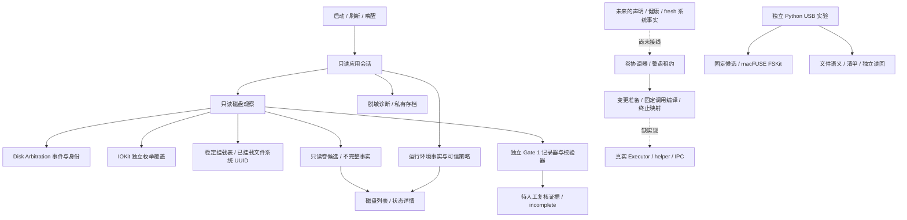

NTFS Lightweight 研发全景审计 — 2026-09-11

审计结论：项目已经形成可以运行的只读 NTFS 助手，写入与推出的安全模型已有较完整实现；隔离实验也已经取得真实 NTFS 镜像文件闭环。但正式可写 MVP 仍缺执行器、身份衔接、helper 和产品接线，不能描述成“代码全部完成，只差用户验证”。目前的停滞同时来自尚未验证的 USB 路径、验证入口缺失，以及历史状态没有及时归位。

本次按 `forgeflow:zoom-out` 阅读领域上下文、ADR、产品计划、实际代码及磁盘文件中的实验记录，由三个独立审计分工交叉核对。审计对象为当前工作区，包括未提交的实验代码；基线 HEAD 为 `6893c95`。本次仅新增审计报告和本地审计输出，保留原有改动；未启动挂载、卸载、推出、格式化、USB 文件操作或管理员认证。构建与测试会写本地构建目录和临时 fixture。

**完成度应按交付能力划分。** 一个整体百分比会把纯逻辑、实物实验和正式产品能力混在一起。

| 交付能力 | 当前实现与证据 | 仍缺什么 |
|---|---|---|
| 本地只读 App | 真实 Disk Arbitration 事件、独立 IOKit 枚举、稳定挂载表、只读候选、菜单栏与主窗口、Setup、脱敏诊断；本次 Release 和本地 ad-hoc 包检查通过 | 完整实物生命周期与人工 UI 验收 |
| 写入/推出安全逻辑 | 完整实例身份、整盘租约、一次性执行、fresh 复核、终止静止确认和结果复核已有纯逻辑 | 正式生产调用链与真实执行器 |
| 数据卷声明 | session/revision、目标及 sibling 拓扑绑定、一次性消费和失效规则已有 resolver | App/独立实物验证入口均未接入 |
| 隔离镜像文件闭环 | 128 MiB NTFS 镜像，34 项文件检查、重挂载独立读回、清理、最终标准卸载有保存证据 | 该轮最大文件为 1 MiB；不覆盖 USB、大文件与完整异常矩阵 |
| 管理员 v2 镜像挂载 | 管理员打开存储后驱动永久降为固定用户，真实可写挂载、标准卸载、驱动退出通过 | 同一 v2 候选的物理 USB 文件闭环 |
| 隔离 USB 文件闭环 | 管理员原始设备读取通过；旧候选执行过标准卸载，随后可写挂载失败 | 新候选的 writable mount、写删、4 GiB + 1 字节、重挂载读回 |
| 正式写入/安全推出 MVP | 协议、编译器与 adapter 纯逻辑骨架已有 | executor、helper/IPC、授权、批准策略、卸载后身份、声明/健康与 UI 接线 |
| 正式发布 | 本地只读包 0.1.0 (1)，arm64、macOS 15.4 deployment target、ad-hoc 签名已检查 | 正式签名、Hardened Runtime、公证及 Gate 5 使用证据 |

证据入口：[正式未完成清单](/Users/leolu/Projects/personal_projects/ntfs-for-mac-lightweight/docs/engineering/implementation-plan.md:86)、[镜像结果](/Users/leolu/Projects/personal_projects/ntfs-for-mac-lightweight/.scratch/write-delete-validation/evidence/image-result.json:1)、[管理员 v2 原始结果](/Users/leolu/Projects/personal_projects/ntfs-for-mac-lightweight/.build/write-validation/context-probe-e5vd5b8g/result.json:1)。镜像文件检查与管理员 v2 挂载对照是两个不同实验，不能合并声称 v2 已完成全部文件检查。

**实际调用地图如下。** 箭头代表调用或事实流；底部变更链尚未与正式 App 接通。



正式依赖边界由 [Package.swift](/Users/leolu/Projects/personal_projects/ntfs-for-mac-lightweight/Package.swift:98) 和本次边界检查共同确认：只读 App 不依赖 `NTFSLiteMutationPreparation`、`NTFSLiteHelperProtocol` 或 Gate 证据工具；实验脚本不进入正式 App。唯一 Swift `Process` 创建点仍为固定的只读 Setup 探针。

```text
当前模块：只读磁盘观察 ReadOnlyDiskObserver
层级：Infrastructure
领域术语：Complete Observation / Independent Enumeration Coverage / Capture Drain Boundary

调用者：
- ReadOnlyAppStore → observations() → 更新正式只读界面
- Gate1EvidenceTool → capture() → 采集、排空并封存独立 Gate 证据

依赖：
- Disk Arbitration 事件源 [Infrastructure] → 原始身份与父子关系
- IOKit 枚举与稳定挂载表 [Infrastructure] → 核对覆盖、挂载与 UUID
- ReadOnlyDiskInventory [Infrastructure，承载领域约束] → 介质代次与候选映射

模块深度：
- 接口：2 个 public 方法，均 0 参数；构造器 5 参数
- 封装：Deep，隐藏事件顺序、收敛、超时、排空与最终枚举
- 穿透方法：observations() 是 capture 的投影包装，同时处理取消/生命周期
```

代码：[ReadOnlyDiskObserver](/Users/leolu/Projects/personal_projects/ntfs-for-mac-lightweight/Sources/NTFSLiteSystem/ReadOnlyDiskObserver.swift:139)。这里只列正式界面和证据工具两个关键调用者，分别代表用户体验与验收事实来源。

```text
当前模块：卷协调器 VolumeCoordinator
层级：Application，内部承载 Domain 状态机
领域术语：Whole-Disk Lease / Mutation Quiescence / Verified Writable / Safe to Remove

调用者：
- 当前主要为 NTFSLiteCoreChecks → 请求与执行接口 → 验证纯逻辑
- 正式只读 App 尚无调用者；未来应由结构化用户请求与 fresh 事实进入

依赖：
- 卷/物理盘实例、SetupAssessment、领域状态机 [Domain] → 操作资格
- resolveEvidence / MountEngine 注入边界 [Application] → 重读事实与执行结果
- 正式系统 executor [Infrastructure] → 尚未实现

模块深度：
- 接口：5 个 public 方法，参数数为 1/1/2/1/1；
        4 个 package 方法，参数数为 3/3/1/2；构造器 3 参数
- 封装：Deep，隐藏同盘互斥、一次性领取、重插、迟到回调和结果收敛
- 穿透方法：state(for:) 是简单状态读取；不是当前验证停滞的主要原因
```

代码：[VolumeCoordinator](/Users/leolu/Projects/personal_projects/ntfs-for-mac-lightweight/Sources/NTFSLiteCore/NTFSLiteCore.swift:1567)。方法统计不含构造器及存储属性；纯逻辑完备度不等于真实执行器已经存在。

```text
当前模块：运行环境事实读取 SystemSetupFactsLoader
层级：Infrastructure
领域术语：Setup Readiness / Dependency Trust Evidence / Conflict Catalog Scope

调用者：
- ReadOnlyAppStore → currentReport() → 更新 Setup 状态与下一步
- 行为检查 → 注入策略/provider → 验证可信、未知和失败关闭的区别

依赖：
- macFUSE/NTFS-3G 身份、摘要与版本读取 [Infrastructure] → 精确依赖证据
- 固定有界 Setup 探针与冲突范围 [Infrastructure] → 系统事实
- 授权 provider [Infrastructure] → 当前默认 unknown

模块深度：
- 接口：3 个 public 方法，均 0 参数；构造器 8 参数
- 封装：Deep，组合探针、信任策略、授权与冲突事实
- 穿透方法：currentFacts()、provider() 是投影/适配包装，主要工作在 currentReport()
```

代码：[SystemSetupFactsLoader](/Users/leolu/Projects/personal_projects/ntfs-for-mac-lightweight/Sources/NTFSLiteSystem/SystemSetupFacts.swift:151)。

**已经通过的验证有明确边界。** 以下历史结论来自本轮重新读取的保存结果，不代表今天重做过硬件实验。

| 证据 | 可支持的结论 | 不支持的结论 |
|---|---|---|
| 2026-09-09 镜像结果 | `fileChecks=34`、`remountVerified=true`、`cleanupVerified=true`，22 个保留文件和 6 个删除项读回 | 物理 USB 通过、4 GiB 通过、Windows 通过 |
| 管理员设备探针的保存记录 | `deviceReadVerified`、512 字节、两次读取一致、无磁盘变更 | writable mount 或文件写入通过 |
| `usb-run-eeqo4enw` | 标准原生卸载已验证；首次可写挂载阶段 `mountProcessExited` | USB `fileChecksPassed`、USB 重挂载通过；也不能声称尝试挂载时磁盘元数据绝未变化 |
| `context-probe-e5vd5b8g` | 协调器 euid 0、v2 驱动实际/有效 uid 501；镜像可写挂载、标准卸载与进程退出 | USB 写入通过；精确 FSKit 内部根因已被完全解释 |
| 三份 Gate 1 canonical artifacts | 本轮当前 verifier 全部校验成功 | 三份均 `incomplete`、`0/100`，不能据此宣布 Gate 1 通过 |

截至本次审计，只找到一轮 USB 全流程的保存目录，未找到 v2 候选的 USB 完整成功结果。原管理员设备读取问题、等待重启、旧 root 镜像启动失败都已有后续进展，不能继续作为当前统一阻塞描述。

**当前机器状态在 2026-09-11 17:43 +08:00 做过只读核对。** 固定入口 `usb_lab.py --inspect` 返回 `blocked / targetQuery / targetAbsentOrAmbiguous`、`diskMutationsPerformed=false`。这只证明当时不能唯一匹配批准目标；不把它武断归因为未插盘。该次在目标查询即退出，未执行依赖检查，因此也不构成今天依赖仍匹配的证据。进程表未见实验 NTFS-3G 进程，挂载表没有 FSKit、macFUSE 或命名实验挂载，也没有原生 NTFS 只读挂载条目。

**当前最影响进度的问题有五项。** 下列发现均未在本次审计中修改实现或放宽 Gate。

1. **[P1，验证流程] Gate 1 声明生命周期检查缺少真实入口。** [recorder 必需检查点](/Users/leolu/Projects/personal_projects/ntfs-for-mac-lightweight/Sources/NTFSLiteGateEvidence/Gate1EvidenceRecorder.swift:471) 和 [人工手册](/Users/leolu/Projects/personal_projects/ntfs-for-mac-lightweight/docs/operations/gate-validation-runbook.md:22) 要求重插、唤醒、重启、拓扑变化、消费后声明失效；但 resolver 的实例化调用仅在 CoreChecks，正式 App 与 Gate CLI 均没有执行该行为的入口。[计划](/Users/leolu/Projects/personal_projects/ntfs-for-mac-lightweight/docs/engineering/implementation-plan.md:88) 把接线留给 Gate 4，Gate 4 又要求 Gate 1–3 通过。这是验收前置循环。应先补独立只读实物验证入口，或显式重新决定这组接线验收属于哪个 Gate，不能要求用户确认不存在的流程。

2. **[P2，诊断] USB 原始失败在收尾等待结束后才落证。** [main 失败路径](/Users/leolu/Projects/personal_projects/ntfs-for-mac-lightweight/scripts/write-validation/usb_lab.py:496) 先调用 `stop_after_failure()`，再 `journal('failed')`；[收尾](/Users/leolu/Projects/personal_projects/ntfs-for-mac-lightweight/scripts/write-validation/usb_lab.py:405) 允许等待尚未退出的驱动。如果一直等待，最初的失败阶段和原因就不会及时出现在终端或 journal。纯 mock 已复现：进入收尾时 `journal/emit` 为空，收尾返回后才记录原始错误。应在等待前持久化原始失败，再单独记录收尾状态；保留驱动与租约的安全规则无需改变。该发现不能反推此前每次等待都由此导致。

3. **[P2，预检] `--inspect` 没有覆盖 USB 当前实际使用的 v2 候选。** [inspect 路径](/Users/leolu/Projects/personal_projects/ntfs-for-mac-lightweight/scripts/write-validation/usb_lab.py:463) 调用旧制品集合的 `dependencies()` 后就返回；实际 v2 `candidate()` 在 [mount()](/Users/leolu/Projects/personal_projects/ntfs-for-mac-lightweight/scripts/write-validation/usb_lab.py:324) 才检查，完整运行此时已标准卸载原生卷。纯 mock 验证：令 `candidate()` 一调用就报摘要不符，`--inspect` 仍退出 0，且该函数调用数为 0。执行前复核仍会阻止后续挂载，问题是可提前发现的错误被延后到了改变原生挂载状态之后。应增加统一、无变更的当前候选与启动先决条件预检，并在变更边界继续复核；`targetMatched` 不能被当成完整运行资格。

4. **[P2，状态管理] 文件顶部仍写着过时的“等待管理员”。** [PLAN 顶部](/Users/leolu/Projects/personal_projects/ntfs-for-mac-lightweight/.scratch/write-delete-validation/PLAN.md:3) 与 [最新管理员 v2 结果](/Users/leolu/Projects/personal_projects/ntfs-for-mac-lightweight/.scratch/write-delete-validation/FSKIT-DIAGNOSIS.md:192) 冲突。仅在末尾追加日志导致每次重新进入任务时容易重走历史诊断。应保留一份最新状态矩阵，历史尝试单独引用；不能继续让用户重复认证来解决已经跨过的问题。

5. **[P2，未来执行契约] “确认未启动”与“可能仍在运行”没有分开。** [MountEngineAdapter](/Users/leolu/Projects/personal_projects/ntfs-for-mac-lightweight/Sources/NTFSLiteMutationPreparation/MountEngineAdapter.swift:17) 要求编译/制品复验失败、没有创建进程时仍返回 `.unconfirmed`；协调器已领取的执行状态只在确认静止后解除，且不能由普通回调绕过。未来接上 executor 后，可能出现没有进程可 reap、整盘租约却长期保留的情况。需要单独表达可信的“未开始执行、零变更失败”，再经 fresh 事实恢复。此为代码审阅发现的未来风险，不是当前只读 App 的运行故障，也不是当前 USB Python 失败根因。

**另有几项实质开发缺口，不能交给用户靠重复验证补齐。**

- 正式 App 默认 `SystemSetupFactsLoader()`：macFUSE、NTFS-3G 的正式信任策略为 nil，授权为 unknown，冲突 active scope/环境基线未批准。安装实验候选和点击刷新不会让它 Ready。[默认注入](/Users/leolu/Projects/personal_projects/ntfs-for-mac-lightweight/Sources/NTFSLiteReadOnlyApp/NTFSLiteReadOnlyApp.swift:41)
- 当前补充 UUID 只适用于已挂载只读候选；卸载后不能把此前 UUID 缓存升级成 fresh mutation 身份。正式写入流程仍需解决卸载后的卷连续身份与事实获取。[ADR 0008](/Users/leolu/Projects/personal_projects/ntfs-for-mac-lightweight/docs/adr/0008-supplement-candidate-identity-from-mounted-filesystem.md:28)
- 真实健康探针尚未接入正式观察，正式 mapper 保持 `health: .unknown`；安全编译器仍缺“核验的文件就是执行的文件”的最终启动保证。helper 当前只有协议，未包含安装、IPC 和权限生命周期。
- 正式写入 UI 与观察→声明/资格→协调器→执行器→系统事实复核的纵向链路尚未形成。本地只读 UI 的人工检查可先做，不必把所有 UI 验收都挡在 Gate 4 后。
- 审计开始时有 5 个已跟踪文件修改和 24 个未跟踪文件；最新实验实现大量存在于未提交工作区，HEAD 不能代表今天可运行的版本。应在审查后形成可追溯的软件基线，并把需要长期保留的脱敏结果移出仅本机 `.build` 的保存范围。本次没有替用户提交代码或移动旧现场。

**Gate 与实验应有不同的推进顺序。** Gate 状态唯一来源仍是 [实施计划](/Users/leolu/Projects/personal_projects/ntfs-for-mac-lightweight/docs/engineering/implementation-plan.md:106)：Gate 1–3 未通过、Gate 4 未进入变更能力、Gate 5 未进入。完整 Gate 1 要 100 次插拔及人工矩阵，Gate 3 还有 100 次生命周期和 Windows 检查，Gate 5 有两周非关键数据使用；这些是仓库选定的正式验收要求，不是本次单轮隔离 USB 实验的前置条件。

[ADR 0009](/Users/leolu/Projects/personal_projects/ntfs-for-mac-lightweight/docs/adr/0009-isolate-local-write-validation.md:7) 已专门解开“必须先完成写入验证才允许任何实验”的循环，用户也已允许 Windows 后置。macFUSE 5.4.0 本次在 [上游发布页](https://github.com/macfuse/macfuse/releases/tag/macfuse-5.4.0) 重新核对，仍标为 pre-release（查询日期 2026-09-11）；这与接受固定候选做隔离实验并不冲突，也不批准正式 App 使用。

推荐下一批工作顺序：

| 顺序 | 可交付工作 | 完成标志 |
|---|---|---|
| 1 | 修实验原始错误即时落证，补当前 v2 候选与运行先决条件的无变更预检，归位最新状态 | 不连接 USB 的回归检查先证明错误可见、候选失败发生在标准卸载之前 |
| 2 | 原固定可牺牲盘可唯一匹配、当前挂载和进程事实核对后，使用同一固定候选执行一次授权 USB 闭环 | 分别出现 `writableMountVerified`、`cleanupVerified`、`fileChecksPassed`、`remountReadbackVerified`、`localChecksPassed`；Windows 继续 false |
| 3 | 并行补 Gate 1 的只读声明实物入口，先验证少量完整周期可以如实记录 | 声明生命周期可以实际操作；证据仍按原规则计数，不降低 100 次验收阈值 |
| 4 | USB 一次闭环有结论后，再组织异常/长期矩阵及后置 Windows 复核 | 每种介质、构建、候选与场景均有独立证据，失败保留现场，不重复无新假设的尝试 |
| 5 | 将正式 executor/helper、卸载后身份和产品接线作为明确开发任务，在适用 Gate 条件满足后集成 | 形成用户点击到系统事实复核的正式闭环，再进入发布条件 |

这条顺序先产出缺失的软件与一次物理盘结论，避免把全部工程工作打包成“继续人工验证”。修复诊断和补只读声明入口可以立即开发；本次没有因为测试盘当前不可匹配而停止这些问题的审计，也没有向用户追加授权要求。

**本次重新执行的检查全部通过，但并未新增硬件通过结论。**

| 检查 | 本轮结果 |
|---|---|
| `scripts/check.sh` | 退出 0 |
| 严格 Release | 全产品 `-warnings-as-errors` 构建通过 |
| Swift 行为检查 | 209 条 PASS 输出 |
| 隔离实验自动化 | 62 项测试通过，真实硬件行为由 fixture/mock 隔离 |
| Gate CLI、只读 package/source 边界 | 通过 |
| 本地 App、签名与五组负向 fixture | 通过；ad-hoc 不等于公证或 Gate 5 |
| 历史 Gate canonical 复验 | 3/3 格式与摘要校验成功；全部 `incomplete / 0/100` |
| 两项 USB 审计 mock 复现 | 延后落证、inspect 未调用 v2 candidate 均复现；不是修复通过 |
| `git diff --check` | 通过 |

完整输出：[check.log](/Users/leolu/Projects/personal_projects/ntfs-for-mac-lightweight/.build/audit-20260911.aUz9eM/check.log)、[Gate 复验结果](/Users/leolu/Projects/personal_projects/ntfs-for-mac-lightweight/.build/audit-20260911.aUz9eM/gate-reverification.json)。测试日志中出现的 `inspectionRequired` 为受控失败场景输出，不是本轮创建了真实挂载残留。

17:49 +08:00 保存审计证据时再次只读核对，结果一致：[当前状态 JSON](/Users/leolu/Projects/personal_projects/ntfs-for-mac-lightweight/.build/audit-20260911.aUz9eM/read-only-state.json)。两项诊断问题的纯 mock 复现已保存为[可重复脚本](/Users/leolu/Projects/personal_projects/ntfs-for-mac-lightweight/.build/audit-20260911.aUz9eM/reproduce_usb_audit_findings.py)和[实际输出](/Users/leolu/Projects/personal_projects/ntfs-for-mac-lightweight/.build/audit-20260911.aUz9eM/reproduce_usb_audit_findings.jsonl)；脚本退出 0 表示成功复现问题，不表示问题已修复。
